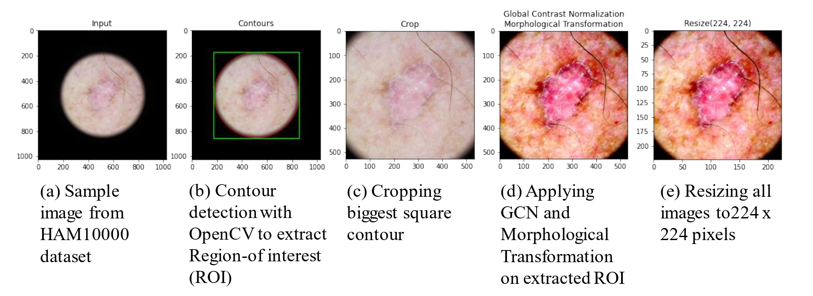

# SkinAid
This is the official implementation of our paper titled:  **SkinAid: A GAN-based Automatic Skin Lesion Monitoring Method for IoMT Frameworks**

**Conference:** 2021 19th OITS International Conference on Information Technology (OCIT). 

Please click [here](https://ieeexplore.ieee.org/document/9719383) to access our paper. 

## Authors:
Prathistith Raj Medi, Praneeth Nemani, Pitta Vivek Reddy, Dr. Venkanna U, Dr. Debanjan Das and Dr. Saraju P. Mohanty

## Abstract:
Not knowing the type of skin lesion or too much-delayed diagnosis can lead to chronic disease or skin cancer. In SkinAid, we propose an application that can not only assist the dermatologist in obtaining a preliminary analysis of detecting, classifying and monitoring the skin lesion but also creates awareness for the user to care for the skin. SkinAid classifies and provides information on several skin lesions. In this regard, the highly unbalanced and limited data leads the existing Deep Learning models to overfit or poorly generalize, resulting in re-duced performance. We explore Generative Adversarial Networks (GANs) to augment and enhance the dataset. Also, we trained a Deep Convolutional Neural Network (CNN) model for edge computing platforms that can automatically detect and classify skin lesions from the captured image of the user's skin. A single-board computer and a smartphone employed as edge platforms have been implemented in SkinAid. The SkinAid model detects and classifies 7 different skin lesions with an overall accuracy of 92.2%. A health worker or patient can capture the real-time skin lesion images using a smartphone app camera to obtain a preliminary analysis to diagnose the skin lesion in Internet-of-Medical-Things (IoMT) platform for remote monitoring by dermatologists.

## Contributions:
- The presence of essential image preprocessing techniques to enhance the process of feature extraction.
- Generation of synthetic data by training the Wasserstain GAN with gradient penalty
- Training a CNN architecture with the (synthetic data + original data) thus obtaining an improved and higher accuracy as compared to other works

## Preprocessing:

## Synthetic Samples:

Sample of Synthetic Data generated by W-GAN: (a) Actinic Keratosis, (b) Melanoma, (c) Melanocytic Nevi, (d) Vascular Lesions

## Conclusion:
In this paper, a smartphone aided IoMT framework for skin lesion detection and classification was formulated using GANs and deep CNNs. The app has been put into meticulous testing on various skin lesions belonging to the seven different classes and has obtained good results on them. The SkinAid app can be used by any  healthcare professional across the globe without the interference of internet to obtain preliminary analysis and classification. It empowers the rural health centres by detecting potential lesions in an early phase, thus reducing the cost of treatment and providing awareness about skin cancers. In the subsequent aspects of the proposed solution, the SkinAid application can be improved to detect more classes of skin lesions with improved accuracy and efficient image data. Security and privacy issues in the Smart Health also needs research within the given constraints.

